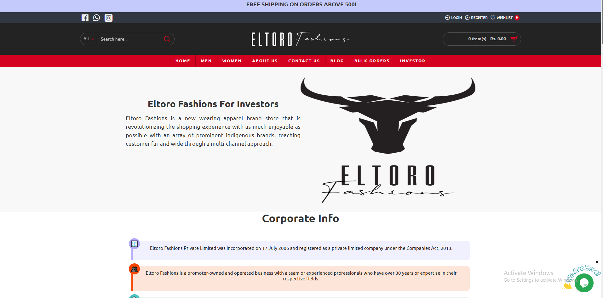
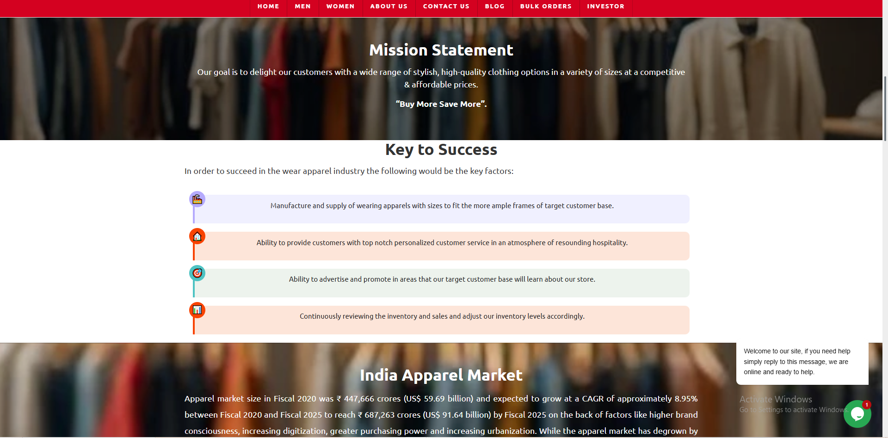
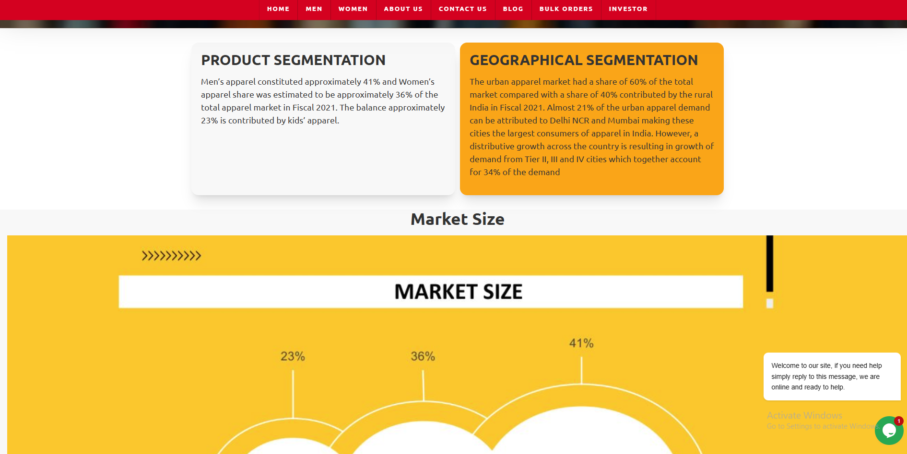
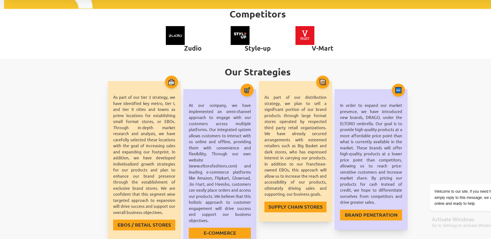

# Eltoro Fashions – Investor Page Frontend Development

Responsive Investor page development for Eltoro Fashions using HTML, CSS, and Bootstrap with structured content hierarchy and clean UI implementation.

## Live URL
https://www.eltorofashions.com/investor

## Project Overview
Developed the Investor Page for Eltoro Fashions focusing on structured layout, responsive design, and clean UI presentation. The objective was to create a professional investor-focused interface with clear content hierarchy and optimized visual alignment.

## My Role – Frontend Developer
- Developed the complete Investor page layout
- Implemented responsive grid system using Bootstrap
- Structured semantic HTML elements
- Adjusted typography, spacing, and alignment
- Optimized UI sections for consistent design flow
- Ensured mobile-friendly responsiveness

## Technologies Used
- HTML5
- CSS3
- Bootstrap
- JavaScript

## Key Highlights
- Clean and well-organized section hierarchy
- Fully responsive layout
- Enhanced UI structure and visual consistency
- Professional investor-focused design implementation

## Project Screenshots

